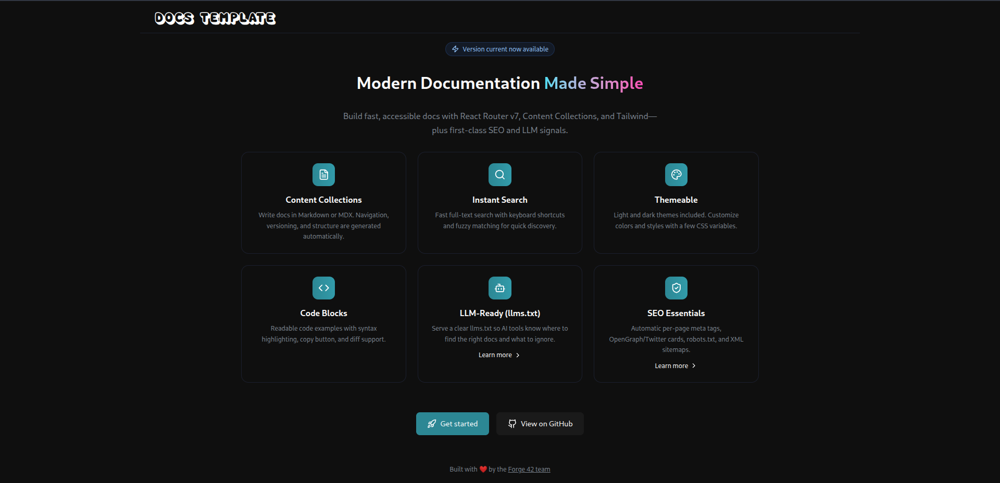
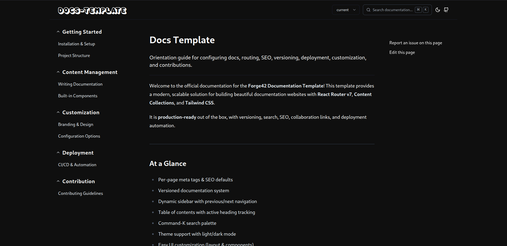

# Welcome to our Documentation Template

This template is designed to support a flexible content structure using `.md` and `.mdx` files organized into folders. It enables deeply nested sections and subsections, making it easy to manage complex documentation with a clear and scalable hierarchy.

<p align="center">
  
</p>

The project is built using the [@forge-42/base-stack](https://github.com/forge-42/base-stack) and leverages the [content-collections](https://github.com/sdorra/content-collections).

> **Note**:
> We added a few `FIXME` comments in the codebase as notes to you. These simply mark small places where we expect you to make changes. Nothing major — it should only take you 2 minutes to go through them.

## Documentation
Detailed documentation can be found here:

https://docs-main.fly.dev/

## Documentation Template Structure Overview

`app/`

This folder contains React Router v7 web application folders and files, including components and UI primitives for the documentation site’s interface, internal hooks and utilities, and the tailwind.css file for styling.

`resources/`

This folder contains all the resources used by the documentation site, such as SVG icons, fonts, and other assets.

`content/`

This folder contains .md and .mdx files that hold your documentation content. Below is the recommended structure to follow.


An example of a valid content/ folder structure for organizing your package documentation:

```
content/
├── _index.mdx
├── 01-changelog.mdx
├── 02-introduction.mdx
├── 03-overview.mdx
├── 04-getting-started/
│   ├── index.md
│   ├── 01-installation.mdx
│   ├── 02-quick-start.mdx
│   └── 03-project-setup.mdx
└── 05-core-features/
    ├── index.md
    ├── 01-authentication.mdx
    ├── 02-authorization.mdx
    ├── 03-data-management/
    │   ├── index.md
    │   ├── 01-fetching-data.mdx
    │   └── 02-caching-strategies.mdx
    └── 04-ui-components/
        ├── index.md
        ├── 01-buttons.mdx
        └── 02-modals.mdx
```
- Top-level .mdx files (like 01-changelog.mdx) are allowed, but we recommend placing them in order before the sections, as shown in the example.

- Sections (like 04-getting-started, 05-core-features) are subfolders inside the `content` folder.

- Subsections (like 03-data-management, 04-ui-components) are nested folders within sections. Filenames inside them should start with `01-*.mdx`.

- Each section or subsection should include an `index.md` file, which defines its sidebar title.

### Example of the valid `**/*.mdx` file:
```
---
title: "Introduction to Forge42 Base Stack"
summary: "Overview of the Stack"
description: "Get started with the Forge42 Base Stack — a modern web app starter template designed for speed, scalability, and developer experience."
---

## What is Forge42 Base Stack?

The Forge42 Base Stack is a full-featured web application starter template. It combines modern tools and technologies like **Remix**, **Tailwind CSS**, **TypeScript**, **Vitest**, and **React Aria Components** to help you build accessible and scalable web apps quickly.

This documentation will guide you through setting up the project, understanding its structure, and customizing it for your needs.

## Installation

To get started with the base stack, simply clone the repository and install dependencies:

```bash
npx degit forge42/base-stack my-app
cd my-app
npm install
```

### Example of the valid `**/*.md` file:
```
---
title: Getting Started
---

```

We have already handled creating the sidebar for you, so based on your content, you will get a modern, automatically generated sidebar that looks like this:

<p align="center">
  
</p>

## Getting started

1. Fork the repository

2. Install the dependencies:
```bash
pnpm install
```
3. Read through the README.md files in the project to understand our decisions.

4. Run `pnpm run generate:docs` script

5. Start the development server:
```bash
pnpm run dev
```

6. After you see that everything works with the current content inside the `content` folder, remove those files and add your own

7. Happy coding!

## Features

### Versioned Documentation
Generate per-tag version folders under `generated-docs/` (for example `v1.0.0/`) to publish and serve multiple doc versions.

**Example:**
````bash
pnpm run generate:docs --versions "^1.0.0"
````

### Local Development Experience
Run `pnpm run dev` to start the dev server and use the hot-reloading `.content-collections/` workflow for fast iteration. The dev server serves live content from `.content-collections/` (your working tree), so it usually shows only the current workspace docs.

**If you need to preview versioned outputs locally, you have two simple options:**

1. Run the generator and serve the `generated-docs/` output (example: `pnpm run generate:docs --branch main --versions="^1.0.0"`). This produces version folders under `generated-docs/` but disables hot-reloading because the site reads the generated output instead of the live `.content-collections/` folder.

2. Create a PR which produces both the versioned `generated-docs/` artifacts and the current snapshot — this is useful for previewing how versioned docs and the live snapshot appear together.

**Note:** When running the generator you must pass the default branch via `--branch` (for example `--branch main`) so the script can deterministically build the default-branch snapshot.


### Automated Docs Generation
The `pnpm run generate:docs` script automates:
- Building the `generated-docs/` folder structure
- Writing `app/utils/versions.ts` which the site consumes to show available versions

### CI/CD Ready
Includes example GitHub Actions workflows to:
- Build documentation
- Pack the `generated-docs` artifact
- Deploy preview or release sites

### Docker + Fly Deployment
Includes `Dockerfile` and sample Fly workflows:
- CI uploads the generated docs artifact
- Deploy job unpacks it into the runner workspace
- Image build includes `generated-docs/`

### Type-Safe and Tested
Built-in quality tooling:
- TypeScript (`tsc`) for type checking
- Biome for linting
- Vitest for testing

### Accessibility & Performance Focused
Opinionated UI primitives and tooling optimized for:
- Accessibility standards
- Fast page loads
- Great developer experience
